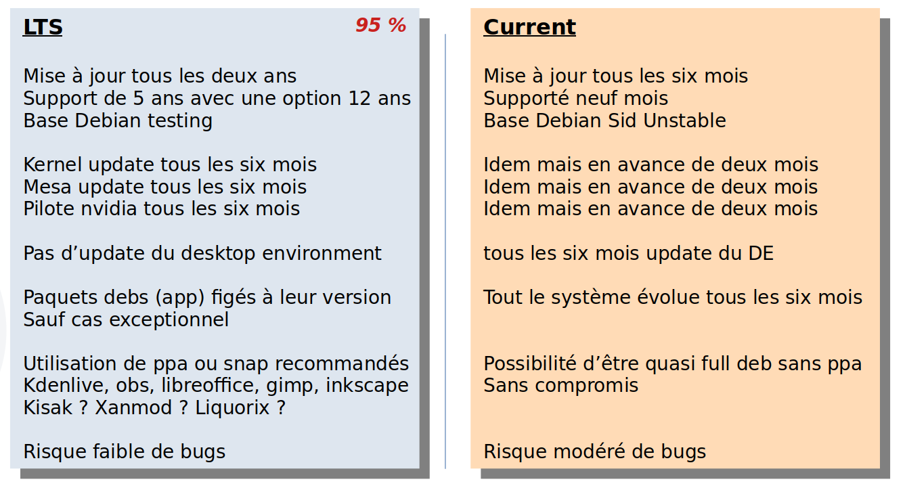

# Installation Ubuntu de A à Z pour la bureautique, le gaming et le multimédia

## Table des matières
---
0. [Choisir Ubuntu LTS ou latest](#lts-ou-latest-telle-est-la-question)
1. [Installation d'Ubuntu](#installation-d-ubuntu)
2. [Update et snap-store](#update-et-snap-store)
3. [Mise à jour et paquets linguistiques](#mise-à-jour-et-paquets-linguistiques)
4. [Installer Gdebi](#installer-gdebi)
5. [Installation des applications de jeux (Steam, Lutris, Goverlay..)](#installation-des-applications-de-jeux)
6. [Guides divers](#guides-divers)
7. [Dépannage et Conseils](#dépannage-et-conseils)

## LTS ou latest: telle est la question

Ubuntu offre deux principales versions de son système d'exploitation : la version Long Term Support (LTS) et la version la plus récente (latest, aussi appelée Current). La version LTS est mise à jour tous les deux ans et bénéficie d'un support pendant dix ans, douze ans si on s'inscrit sur Ubuntu pro, qui est gratuit jusqu'à cinq ordinnateurs par personne, ce qui la rend idéale pour ceux qui recherchent stabilité et fiabilité. La version latest, quant à elle, est mise à jour tous les six mois et inclut les dernières innovations logicielles, mais elle n'est supportée que pendant neuf mois. 

- **Pour les utilisateurs de bureau et les entreprises**, il est généralement conseillé d'opter pour la version LTS.
- **Les utilisateurs avancés** qui ont besoin des dernières fonctionnalités, la version latest peut être plus appropriée.



## Installation d'Ubuntu
L'installation d'Ubuntu est un processus simple. Voici les étapes de base :

1. **Télécharger l'image ISO** de Ubuntu depuis le [site officiel](https://ubuntu.com/download).
2. **Créer un support d'installation** voir notre [Guide créer une clé USB bootable](/Gaming-Linux-FR/usb-bootable#readme)
3. **Démarrer l'ordinateur à partir du support d'installation**.
4. **Suivre les instructions à l'écran** pour partitionner le disque et installer le système. L'installateur d'Ubuntu guide les utilisateurs à travers les étapes nécessaires pour configurer le système d'exploitation. Dans cette [vidéo d'Adrien Linuxtricks](https://youtu.be/B9iR8JDpLFw?t=188), vous pourrez voir plus en détail les étapes de l'installation avec Ubuntu 24.04 LTS.

Si vous êtes débutants, on vous conseille grandement de prendre l'installation **complète** et de bien cocher la case pour avoir les **logiciels tiers** comme sur les captures d'écran ci-dessous afin d'être sûr d'avoir tout le nécessaire.


## Update et snap-store

La première chose à faire va être de vérifier que votre Ubuntu est bien à jour et de redémarer après application d'éventuelles mises à jour.


Si vous rencontrez ce bug qui hélas est devenu un grand classique : 


Il faudra taper dans le terminal :

```bash
snap refresh
```


## Mise à jour et paquets linguistiques

Si vous remarquez des applications non traduites, l'outil suivant devrait télécharger les paquets linguistiques manquants :


## Installer Gdebi

Gdebi va nous servir à installer des .deb pour les applications de jeux parce que Ubuntu priorise les SNAP et ils ne fonctionnent pas toujours correctement pour le jeu.


## Installation des applications de jeux

Les SNAP n'étant pas encore au point pour la partie gaming, on recommande donc les .deb pour Steam, Lutris et Heroic Game Launcher

### Steam

La version SNAP pose problème à encore beaucoup d'utilisateurs, même si ces problèmes semblent ne toucher que les possesseurs de carte Nvidia. À vous de voir sur quelle version vous partez, dans le doute je préfère vous recommander de prendre **steam-installer** (le .deb) qui est la version officielle, recommandée et maintenue par valve.

Si on suit mes recommandations et que l'on prend **steam-installer** il faudra entrer la commande **`dpkg --add-architecture i386`** puis **`sudo apt update`** dans un terminal avant d'installer steam.


Lien : **[Guide de post-installation pour Steam](/Gaming-Linux-FR/steam-post-install)**

### Lutris et Heroic Game Launcher

On télécharge le dernier .deb des github de Lutris et Heroic 


Lien vers **[Githhub Lutris](https://github.com/lutris/lutris/releases)**

Lien vers **[Githhub Heroic](https://github.com/Heroic-Games-Launcher/HeroicGamesLauncher/releases)**

Et on les installe avec **`Gdebi`**. Pour le premier, il faudra faire `clic droit`, `ouvrir avec` et utiliser `Gdebi` en cochant bien `Toujours utiliser pour ce type de fichier` :


Pour les .deb suivants il suffira de `double cliquer` dessus pour qu'ils s'installent.

## Guides divers

- **[Formater et monter un disque](/Gaming-Linux-FR/guide-formater-monter)** : Formater et monter au démarrage ses disques / SSD internes sur Linux
- **[Astuces](/Gaming-Linux-FR/glf-astuces)** : Astuces diverses, ne concernant pas une distribution spécifique.

## Dépannage et Conseils

Ce guide vise à offrir une introduction complète à l'utilisation de Ubuntu pour le gaming et le multimédia. Pour des problèmes spécifiques, n'hésitez pas à rejoindre notre discord : 

[](https://discord.gg/WCAKxxRA3t)

Ce guide est destiné à être régulièrement mis à jour. Vos retours et contributions sont les bienvenus pour aider à enrichir cette ressource et assister d'autres utilisateurs dans leur expérience Ubuntu.

